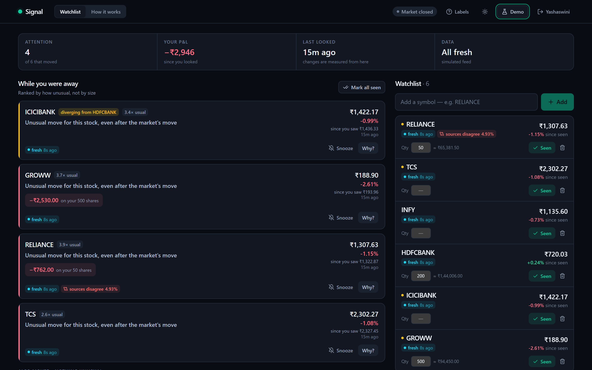
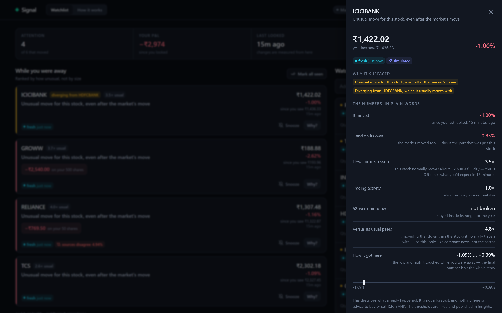
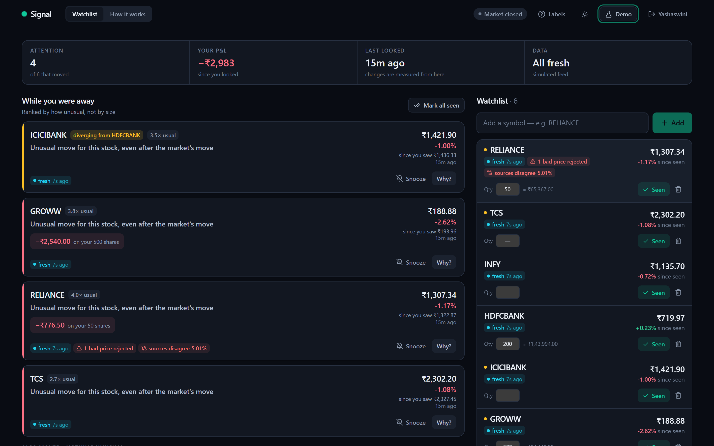

<div align="center">

# Signal

**A watchlist that answers one question well:<br>*what changed that I should care about since I last looked?***

[](https://github.com/PES2UG23AM064/signal-watchlist/actions/workflows/ci.yml)


**[Live app](https://signal-watchlist-web.onrender.com)** · **[API docs](https://signal-watchlist-api.onrender.com/docs)**

*Built for Code by Groww 2026. Open the live app on a phone.*



</div>

---

## What it is, in one screen

Every watchlist shows a grid of prices. None of them tell you what *happened* while you were away — and on a
red day they all scream about every stock at once, which is exactly when you need triage.

Signal opens on a ranked **"While you were away"** digest. Each card says **one thing in plain English**, shows
how unusual that was *for this particular stock*, and anchors it to **the price you saw and when** — every number
behind it is one tap away, and nothing is a forecast. Two stocks that always move together fold into one card;
the one moving *alone* is promoted. If you say what you hold, moves become rupees. Every price says how fresh it
is and where it came from.

**The core technical bet — "since you last looked" cannot be a timestamp.** The market data from that moment is
gone; you can't recompute the diff later. Signal stores a **snapshot of what you actually saw** (price, index
level, event-time) and diffs live quotes against it. The snapshot is a **monotonic watermark**: it only moves
forward, so a second device or a late, out-of-order quote can never move your baseline backward. That one
decision is what makes cross-device state, the demo rewind and the integrity tests possible.

---

## Contents

- [Quick start](#quick-start)
- [The product](#the-product)
- [Architecture](#architecture)
- [Reliability and data integrity](#reliability-and-data-integrity)
- [Codebase and tests](#codebase-and-tests)
- [What the data said](#what-the-data-said)
- [Decisions and trade-offs](#decisions-and-trade-offs)
- [Configuration](#configuration) · [Deployment](#deployment) · [Project structure](#project-structure)

---

## Quick start

You need **Python 3.12**, **Node 22**, and a Postgres `DATABASE_URL` (a free [Supabase](https://supabase.com)
project works — use the **session-mode** string on port 5432; [why](#configuration)).

```bash
# 1. API + poller
cd backend
python -m venv .venv && ./.venv/Scripts/activate      # macOS/Linux: source .venv/bin/activate
pip install -r requirements.txt
cp .env.example .env                                   # paste DATABASE_URL (URL-encode '@' in the password as %40)
python -m uvicorn app.main:app --reload --port 8000    # migrations run on startup; docs at /docs

# 2. UI (second terminal)
cd frontend && npm install && npm run dev              # http://localhost:5173

# 3. Verify
cd backend && pytest tests -q --ignore=tests/integration   # 47 unit tests, no DB, ~1s
```

**Then:** create an account, add `RELIANCE`, `TCS`, `INFY`, `HDFCBANK`, `ICICIBANK`. Press **Mark all seen**,
then **Demo → "Pretend I last looked 15 minutes ago"** — the digest fills with exactly what you would have seen.
Press **Why?** on a card. Open **Break it on purpose**.

---

## The product

### The return loop

| | |
|---|---|
| **Adding a symbol is your first look at it** | That price becomes the baseline immediately — the digest works from your first return visit with no extra step. |
| **Mark seen** freezes a new baseline | Per (user, symbol): price, index level, event-time. Monotonic — never moves backward. |
| **"While you were away"** | Every symbol that moved since your snapshot, ranked by how unusual the move was *for that stock*. Meaningful moves are cards; the rest are one quiet line each under "also moved" — nothing is hidden, nothing is noise. A move under one basis point is flat. |
| **Snooze** | Hold a symbol out of "needs attention" for an hour. Still listed. |
| **Identity that follows you** | Email + bcrypt password, one session per device (tokens stored hashed). Signing in on your phone does not sign your laptop out; logout kills *that* session everywhere it was copied. 30-day expiry, lockout after 5 failures, non-enumerating errors. |

### What "meaningful" means

All denominators are **real**: a year of NSE daily candles per symbol (Yahoo), cached in Postgres — daily σ,
20-day volume, 52-week range, β vs NIFTY. "2σ" means 2σ *of this stock's own history*.

| Signal | Definition | Flags at |
|---|---|---|
| **Market-adjusted move** | `\|move − β·NIFTY move\| / (σ_daily · √elapsed)` — a move the whole market made isn't news about this stock; √time puts a 4-hour move and a 3-day move on one scale | ≥ 2σ |
| **52-week break** | New high/low since your snapshot | any |
| **Path excursion** | Peak move since you looked, from the quote ring — a stock that ran +3% and came back flat still *happened* | ≥ 2σ |
| **Moving alone** | Peer-residual z-score vs the stocks it usually moves with | ≥ 2 |
| **Volume** | vs 20-day average. *Supporting only*: shown and ranked, never promotes a symbol by itself — it's about today, not your window | ≥ 1.5× |

Thresholds are fixed and published. Ranking weights are a transparent 1:1:1 in σ-equivalent units, plus a capped
term for a retraced spike and the peer-divergence term. Holdings *amplify* rank (`× (1 + log₁₀(1 + |₹ impact| /
1000))`, ≈×2 at ₹10k at stake) but never drown out an unusual move you don't hold.

<div align="center"></div>

### Honest data state — three independent axes, always shown

| Axis | What it tells you |
|---|---|
| **Market** | Real IST trading hours + the 2026 NSE holiday table. |
| **Freshness** | Age of *this* price: **fresh** (≤20s) → **delayed** (≤120s) → **stale**. Deliberately not the word "live" — age and source are different facts. |
| **Source** | **"simulated"** whenever data is the Replay generator rather than a feed — said once in the summary strip when the whole page is on one source, on every price when sources are mixed. |

### Not built, on purpose

| Idea | Why not |
|---|---|
| LLM narration | Can't be backtested; would undermine an auditable definition |
| Learned ranking weights | The backtest said no — see [What the data said](#what-the-data-said) |
| Changepoint detection / EWMA thresholds | The user's own snapshot *is* the changepoint they care about; EWMA makes the alert threshold itself volatile |
| Per-signal acknowledge | Symbol-level Seen + snooze already cover the inbox semantics |
| OAuth | A provider config, not an architecture change; the hard-to-retrofit parts (explicit sign-up, hashing off the event loop, sessions, lockout) are real |
| Redis / Kafka / a worker tier | Postgres is enough at this scale — [what changes when it isn't](#scale-measured-not-assumed) |

---

## Architecture

```
┌────────────────────────────────┐        ┌──────────────────────────────────────────────────────┐
│  React 18 + Vite + Tailwind    │  HTTP  │  FastAPI (async) — ONE process / ONE container         │
│  mobile-first                  │◄──────►│                                                        │
│                                │        │  ┌───────────────┐   ┌─────────────────────────────┐  │
│  GET /state on every SSE tick  │  SSE   │  │ API routers   │   │ In-process poller (asyncio) │  │
│  (30s polling fallback)        │◄───────│  │ auth·watchlist│   │ • advisory-lock leader+lease │  │
└────────────────────────────────┘        │  │ state·model   │   │ • one fetch per unique symbol│  │
                                          │  │ status·dev    │   │ • sanity quarantine          │  │
                                          │  └───────┬───────┘   │ • publishes tick on event bus│  │
                                          │          │           └──────────────┬──────────────┘  │
                                          │          │    MarketDataProvider    │                 │
                                          │          │   ┌──────────────────────┴───────────────┐ │
                                          │          │   │ Composite: Yahoo (live, breaker)     │ │
                                          │          │   │   ├─ fallback → Replay (simulated)   │ │
                                          │          │   │   └─ secondary → Twelve Data (audit) │ │
                                          │          │   └──────────────────────────────────────┘ │
                                          └──────────┼─────────────────────────────────────────────┘
                                                     ▼
                                          ┌──────────────────────────┐
                                          │  Supabase Postgres       │
                                          │  asyncpg, explicit SQL   │
                                          │  quotes · read_state ·   │
                                          │  baselines · sessions    │
                                          └──────────────────────────┘
```

**Data model.** `quotes` is an append-only time series with `unique (symbol, event_time)`: ingestion is
idempotent and the served value is always `max(event_time)`, so a late or out-of-order arrival structurally
cannot become what you see. `read_state` holds the per-(user, symbol) snapshot with a `watermark_event_time`
that the upsert refuses to move backward. `symbol_baselines` caches a year of real candles and the derived σ /
β / volume / 52-week figures. `sessions` is one row per device.

**Shared poller (fan-in).** One asyncio task fetches each *unique* watched symbol (plus NIFTY) once per cycle,
regardless of how many users watch it, and writes the whole cycle in one `executemany`. A bad cycle is logged and
skipped, never fatal. Rows older than 24h are pruned.

**Exactly one writer.** A Postgres session-level advisory lock on a dedicated connection elects the poller
leader; followers re-check every interval. The lock session heartbeats and carries a 60s server-side lease
(`idle_session_timeout`), so a leader that dies *without* closing its session — a spun-down container, a dropped
TCP link — loses the lock within a minute instead of holding it as a zombie. Exclusivity is tested across two
real sessions; takeover was observed live at 20s.

**Providers.** One `MarketDataProvider` interface, three implementations: `replay` (deterministic, anchored to
each stock's real last close and sized in its real σ), `yahoo` (live, token-bucketed at 30/min with bounded
concurrency; the poll interval stretches to stay inside the budget rather than wedging), and `composite`
(live while NSE is open; circuit breaker 3 strikes → 60s open → one half-open trial; labelled fallback; optional
second feed recorded as a cross-check that can never be served).

**Push.** The poller publishes a tick on an in-process bus after each cycle; `/events` streams it over SSE with
no user data (so no token in a URL); clients refetch `/state`. Polling stays as the fallback transport.

**One round-trip for the whole dashboard.** `/state` returns market status, watchlist, ranked changes and cohorts
in two waves of concurrent reads (peak excursions are one `unnest` join, not N queries).

### Scale, measured not assumed

A 30-symbol watchlist against the live deployment initially pushed the poll cycle to 6.5s (interval 5s) and
`/state` to 3–7s. Cause: N+1 round-trips × ~200ms cross-region RTT (Render Oregon ↔ Supabase Singapore). Fixed by
batching writes, `unnest` joins, one-query candle loads and concurrent reads: poller cycle well under the
interval, warm `/state` ~1s. The remaining lever is colocation — `render.yaml` pins the API to Singapore. The
honest breaking point is the poll loop itself, when unique symbols make a cycle exceed the interval; `/status`
reports cycle time vs interval and warns. Leader election already makes a second instance safe; the one step to
run several is swapping the in-process bus for Postgres `LISTEN/NOTIFY` (same publish/subscribe surface).

### API

All endpoints except `/auth/register`, `/auth/login`, `/health`, `/market`, `/status`, `/model`, `/events` require
`Authorization: Bearer <token>`. Interactive docs at [`/docs`](https://signal-watchlist-api.onrender.com/docs).

| Method | Path | Purpose |
|---|---|---|
| `POST` | `/auth/register` | Create an account → session token; `409` if taken |
| `POST` | `/auth/login` | Sign in → session token for this device; `401` generic, `429` when locked |
| `GET` | `/auth/me` | Validate a remembered token |
| `POST` | `/auth/logout` | End this device's session (`?everywhere=true` ends all) |
| `GET` | `/state` | Market + watchlist + ranked changes + cohorts, one round trip |
| `POST` | `/watchlist` | Add a symbol and take its first snapshot. `400` not a ticker · `404` not on NSE · `503` can't verify a price now — a typo never becomes a dead row |
| `DELETE` | `/watchlist/{symbol}` | Remove a symbol and its snapshot |
| `POST` | `/watchlist/{symbol}/seen` · `/watchlist/seen-all` | Advance the snapshot (monotonic) |
| `PATCH` | `/watchlist/{symbol}/quantity` | Shares held (validated ≥ 0) |
| `POST` | `/watchlist/{symbol}/snooze?minutes=60` | Hold out of "needs attention"; `0` clears |
| `GET` | `/events` | SSE: `quotes_updated` after each poll cycle |
| `GET` | `/model` | Backtest + cohort validation report |
| `GET` | `/status` | Provider route, breaker, poller role/lease/cycle, per-symbol freshness, quarantines |
| `GET` | `/market` · `/health` | NSE open/closed (IST) · liveness |
| `POST` | `/dev/inject` · `/dev/rewind` | Fault injection · snapshot rewind (auth-scoped, simulator-only, `ENABLE_DEV_ENDPOINTS`) |

---

## Reliability and data integrity

<div align="center"></div>

| Failure | What the system does |
|---|---|
| **Impossible tick** — price ≤ 0, negative volume, future timestamp, single-tick jump beyond NSE's 20% circuit band | Quarantined: stored for audit with `is_suspect`, never served. Judged against a *recent* reference and the real last close, so a stale wrong price can't block correct data forever. The card shows "N bad prices rejected"; the count is windowed on when we *received* it, so a future-dated tick can't read as recent for an hour. |
| **Two feeds disagree** | The second feed is `role='secondary'` and cannot be served. Divergence beyond 2% within 120s → the symbol reads **"sources disagree"** with both prices. We never silently pick one. |
| **Late / out-of-order arrival** | `max(event_time)` wins structurally; the unique constraint makes re-ingestion a no-op. |
| **Two devices mark seen at once; a stale write** | The watermark upsert only advances (`where excluded.watermark >= current`). Tested against a real Postgres. |
| **Two instances polling** | Advisory-lock leader election; the lock is re-verified right before each write; a leader that loses its session skips the write. Tested across two sessions. |
| **Leader dies without closing its session** | Heartbeat + 60s `idle_session_timeout` lease: Postgres itself ends the zombie session and a follower takes over within a minute. |
| **Live feed down / rate-limited** | Circuit breaker: 3 strikes → 60s open → one half-open trial. Every quote falls back to the labelled simulator; the app never errors; the source badge says which path served it. Token bucket + bounded concurrency on the way in. |
| **Upstream silently stops for one symbol** | Nothing fake is written; the price ages and its badge goes fresh → delayed → stale. (`stale` fault demonstrates it.) |
| **Ticker doesn't exist / was renamed (e.g. TATAMOTORS after the demerger)** | `404` at add time with a readable message. A symbol with no real anchor is never given an invented price — it reads "no data" rather than a number. |
| **Junk input** (`""`, `"not a ticker!"`, `../`) | `400` from one exception handler, whichever route it arrives through. |
| **Unknown email / wrong password / brute force** | Same generic `401` with equalized bcrypt timing; 5 failures lock for 15 minutes; hashing runs off the event loop so SSE streams don't stall. |
| **Yahoo 404 for a delisted symbol on a live poll** | Omitted from the batch; the rest of the cycle proceeds. |
| **Cross-region latency** | Batched writes, `unnest` joins, concurrent reads, warm pool sized to Supabase's 15-client pooler cap (a real limit, hit during testing). |

**Break it on purpose.** `POST /dev/inject` — and the panel of the same name, shown only on simulated data — sends
`garbage` (price 0), `jump` (+35%), `future` (+1h), `stale` (pause upstream 2.5 min) and `conflict` (second feed 5%
off) through the **real** ingestion path, so all of the above is demonstrated rather than described.
`POST /dev/rewind` reconstructs your snapshots as of N minutes ago — exactly, because the simulator is a pure
function of time.

**Two incidents that changed the design.**
1. *Dual writer.* A local poller and the deployed one — different versions, different price anchors — wrote to
   the same table and "latest = max(event_time)" flipped between them (a 43% swing on one symbol). Fixes: the
   jump quarantine now sits at NSE's real 20% band so a misbehaving writer's rows are refused, not served; the
   quarantine judges against a recent reference only; and one writer is enforced by the lock, not by discipline.
2. *Zombie leader.* A spun-down free-tier container kept its lock session alive for minutes; the local instance
   was a follower and every quote went stale. That is where the heartbeat lease came from.

---

## Codebase and tests

- **Size.** ~3,300 lines of backend Python, ~2,900 of frontend, 11 plain-SQL migrations, **10 runtime Python
  dependencies** and 3 npm ones. scikit-learn is dev-only: the backtest runs offline and ships a JSON report, not a
  model; production scoring is arithmetic on real baselines and the cohort model is ~15 lines of numpy.
- **Explicit over clever.** asyncpg with hand-written SQL — every query is visible, including the
  integrity-critical watermark upsert. One process, one datastore; no ORM, no Redis, no broker, no worker tier.
  Each is a documented decision with the condition under which it would change.
- **Tests check the claims.** 47 unit tests: scoring math, the **no-look-ahead guarantee** on the feature code
  (written before the backtest), quarantine rules, market hours and holidays, the breaker's state machine,
  cohort clustering including "nothing is ever hidden", ranking (holdings amplify but never drown out), the
  simulator's determinism and "no calm window ever flags", and "volume alone never promotes". 5 integration tests
  against a real Postgres: quarantine/roles/disputes, the stale-reference escape hatch, the monotonic watermark,
  leader-lock exclusivity across two sessions, and the full account lifecycle including multi-device sessions.
- **CI on every push** ([ci.yml](.github/workflows/ci.yml)): ruff, unit tests, the integration suite against a
  Postgres 16 service container, and a production frontend build.
- **Driven end to end.** Beyond the unit and integration suites, the whole surface has been exercised through
  HTTP (117 checks) and through headless Chrome against the deployed site (40 checks: register → add → rewind →
  explain → holdings → snooze → mark seen → every fault → theme → mobile → logout → multi-device).

```bash
cd backend
pytest tests -q --ignore=tests/integration      # unit
INTEGRATION=1 pytest tests/integration -q       # needs DATABASE_URL
ruff check app ml tests
python -m scripts.smoke                          # end-to-end against a running API
```

---

## What the data said

### The ML result we ship is a negative one

Before trusting "meaningful", the same feature code was asked whether it **predicts** anything
([`ml/train_scorer.py`](backend/ml/train_scorer.py)): a year of real daily candles for **29 NSE symbols**,
**5,249 symbol-days**, time-ordered split with a 3-day embargo, out-of-sample, three pre-registered questions.
Confidence intervals come from a **block bootstrap over 3-day blocks of trading days** (all symbols of a day
resampled together) — a row bootstrap would pretend 5,000 correlated rows are independent.

| Question | Test AUC (95% CI) | Verdict |
|---|---|---|
| Does an unusual move predict more big moves over the next 3 days? | 0.51 (0.47 – 0.55) | **No edge** |
| Does it predict the *direction* of the next move? | 0.52 (0.48 – 0.55) | **No edge** — so the app never says what to buy |
| Does it predict an unusually *active* period? | 0.54 (0.50 – 0.57), top-decile lift 1.3× | **No edge** by the CI; far below the bar |

The bar was fixed before looking: CI excluding 0.5 *and* top-decile lift ≥ 2×. Nothing came close, so **no
learned model ships** and the ranking stays descriptive — not from caution, from evidence. The report is served at
`GET /model` and shown in the app under **How it works → See the evidence**, failed hypotheses included.

### Where ML does earn its place: who moves with whom

Indian retail watchlists are mostly correlated large-caps. [`cohorts.py`](backend/app/cohorts.py) clusters
*your* symbols by daily-return correlation over the real candles (average-linkage, merge while mean ρ ≥ 0.5, no
labels, no sector table). Validated on the same candles ([`ml/validate_cohorts.py`](backend/ml/validate_cohorts.py)):
from returns alone it found **banks** `{AXISBANK, HDFCBANK, ICICIBANK}`, **IT** `{HCLTECH, INFY, TCS, TECHM, WIPRO}`,
**metals/infra** `{JSWSTEEL, TATASTEEL, LT, ULTRACEMCO}`, **power** `{NTPC, POWERGRID}` — within-cohort ρ 0.61 vs
0.20 across. Replaying the year, digest cards fell **1,152 → 987 (−14%)** with **103 "moving alone" flags and 0
ever folded into a group** — an invariant the validation asserts. Half-year stability is modest (ARI 0.30) and the
app says so.

## Decisions and trade-offs

- **Why a snapshot and not a timestamp?** The data from that moment is gone. It is also why the rewind is exact and why the
  cross-device story holds.
- **Why no LLM?** The scoring can be backtested; a narration cannot. In a field whose originality play is the
  LLM, this chose a definition it can prove.
- **Why fixed thresholds?** Because learned weights would be trained on a signal the backtest showed has no edge.
- **Why a simulator, and is it honest?** NSE is closed most of the time. It is labelled everywhere, anchored to
  real closes, sized in real σ, produces one scripted event per symbol per 20 minutes with alternating direction
  (so calm windows never flag — tested), and is never used to train or validate anything.
- **Stated limitation.** The √time scaling is assumed to hold intraday. Approximately true; not validated here —
  Yahoo gives 7 days of 1-minute bars and validating on the simulator would be circular.
- **With another week:** colocate app and DB (in config, needs a redeploy); `LISTEN/NOTIFY` for multiple
  instances; validate √t on real intraday history; a broader symbol universe for the cohort model.

---

## Configuration

Backend settings come from `backend/.env` ([`.env.example`](backend/.env.example)).

| Variable | Default | Notes |
|---|---|---|
| `DATABASE_URL` | — | **Required.** Supabase **session-mode** string (port 5432): advisory locks live in the session, and the transaction pooler (6543) recycles it. The pooler allows 15 clients per project; each instance uses ≤ 5. |
| `MARKET_PROVIDER` | `replay` | `replay` · `composite` · `yahoo`. The deployed demo runs `replay` on purpose: reproducible, and the rewind only makes sense on the simulator. |
| `REPLAY_SEED` | `42` | Deterministic seed |
| `TWELVEDATA_API_KEY` | — | Optional second real feed (composite only) |
| `DISPUTE_THRESHOLD_PCT` / `DISPUTE_WINDOW_SECONDS` | `2.0` / `120` | Primary vs secondary divergence ⇒ "disputed" |
| `POLL_INTERVAL_SECONDS` | `5` | `/status` warns when a cycle exceeds it |
| `QUOTE_RETENTION_HOURS` | `24` | Time-series retention |
| `RUN_POLLER` | `true` | `false` runs the API without ingestion |
| `ENABLE_DEV_ENDPOINTS` | `true` | On for the demo |
| `CORS_ORIGINS` | `http://localhost:5173` | Comma-separated; `*.onrender.com` and any `localhost`/`127.0.0.1` origin are allowed by regex |

Frontend: `VITE_API_URL` (default `http://localhost:8000`).

## Deployment

Two free [Render](https://render.com) services from [`render.yaml`](render.yaml): `signal-watchlist-api`
(FastAPI + poller, one container, health check on `/health`, `DATABASE_URL` set in the dashboard) and
`signal-watchlist-web` (Vite static build, `VITE_API_URL` set to the API URL). Migrations apply on startup.
The API is pinned to the **Singapore** region, next to the database; Render cannot move an existing service,
so to apply it to an already-deployed API: delete the service, **Blueprint → Manual Sync** (same name, subdomain
reused), re-enter `DATABASE_URL`. The free tier sleeps after 15 idle minutes; the first request takes ~30s.

## Project structure

```
signal-watchlist/
├── backend/
│   ├── app/
│   │   ├── main.py            FastAPI app; lifespan wires DB pool, migrations, poller
│   │   ├── config.py          Settings
│   │   ├── auth.py            Email + bcrypt, per-device sessions, lockout
│   │   ├── services.py        Watchlist, snapshots (monotonic watermark), digest assembly, ranking
│   │   ├── scoring.py         Market-adjusted σ move, 52-week breaks, flags — shared with the backtest
│   │   ├── cohorts.py         Return-correlation clustering; peer-residual "moving alone"
│   │   ├── baselines.py       Real daily candles → σ, 20-day volume, 52-week range, β
│   │   ├── quotes.py          Time-series ingestion, sanity quarantine, freshness
│   │   ├── poller.py          Shared per-symbol poller; advisory-lock leader with heartbeat lease
│   │   ├── events.py          In-process event bus → SSE
│   │   ├── market.py          NSE hours (IST) + 2026 holiday table
│   │   ├── symbols.py         Ticker normalization and validation
│   │   ├── providers/         replay · yahoo · twelvedata · composite (circuit breaker)
│   │   ├── routes/            auth · watchlist · state · model · status · events · dev
│   │   └── model/             backtest_report.json · cohort_report.json (served by /model)
│   ├── migrations/            001…011 plain SQL, idempotent, applied on startup
│   ├── ml/                    train_scorer.py (backtest) · validate_cohorts.py
│   ├── scripts/smoke.py       End-to-end smoke test
│   └── tests/                 47 unit · integration/ (5, DB-backed)
├── frontend/src/
│   ├── App.jsx                State, SSE + polling transport, drawers
│   └── components/            digest/ · watchlist/ · how/ · insights/ · auth/ · demo/ · layout/ · ui/
├── docs/screenshots/
├── .github/workflows/ci.yml
└── render.yaml
```

## Tech

FastAPI · asyncpg · Pydantic · numpy · Supabase Postgres · React 18 · Vite · Tailwind CSS · Render · GitHub Actions
